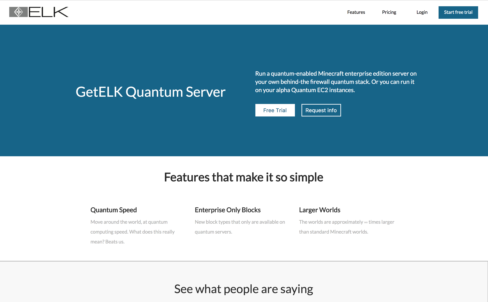

# GetElk
## Version 1.0.0
* GetElk is a fullstack React/Redux application, utilzing a Node.js/Express server. Data is retrieved from an external API and sent from the sever to the client. All of the data is fetched prior to page rendering. Both testimonials and page content are stored in separate redux stores. GetElk is fully responsive for all devices including smartphones and tablets.



# Tech Stack
## Frontend
* [React](https://facebook.github.io/react/)-[Redux](https://github.com/reactjs/redux) - JS libraries for rendering page views and maintaining state
* [React Router v4](https://github.com/ReactTraining/react-router) - Routing library for React applications, enabling URL for specific views
* [LESS](http://lesscss.org/) - CSS preprocessor

## Backend
* [Node.js](https://nodejs.org/en/) with [Express](http://expressjs.com/) for API endpoints

## Dev/Build Tools
* [Webpack2](https://webpack.js.org/) for bundling/scaffolding and [Babel](https://babeljs.io/) for transpiling

## Install
#### Global Installs

For running Node server

```
$ brew install node
```

For building and deploying: Webpack

```
$ npm install webpack -g
```
#### Local Install

Download all dependencies listed under package.json

```
$ npm install
```

#### To Run the Application
Initiate both Development and Production servers by running the following:

```$ npm run build``` and then ```$ npm run start```. Once complete, in a separate terminal run ```$ npm run dev```

Fronend development changes are reflected immediately on ```http://localhost:8080```
Production server is on ```http://localhost:3000```

## Contributing

I am happy to review and merge pull requests. Please see [CONTRIBUTING](CONTRIBUTING.md) if you'd like to add to this fun project!

## License

MIT
